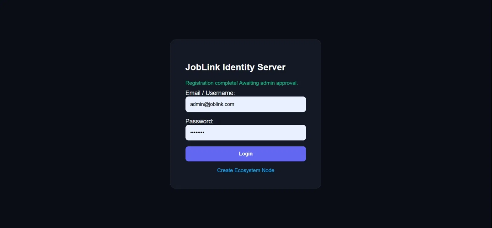
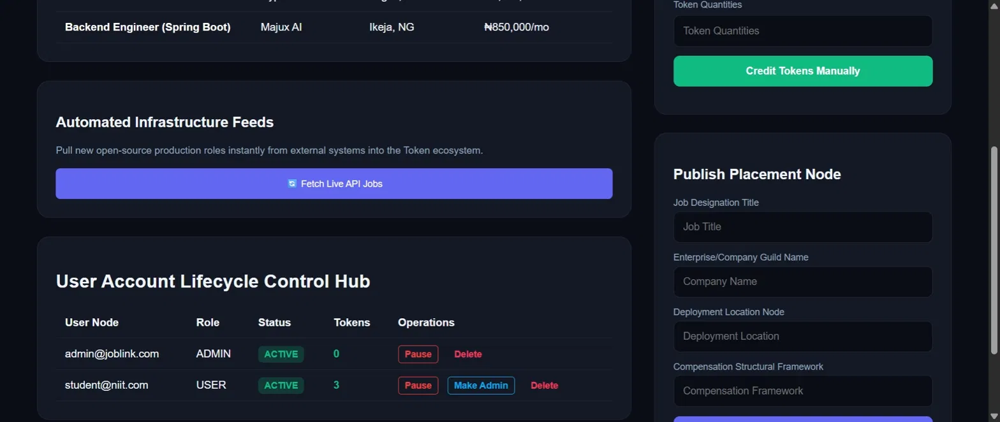
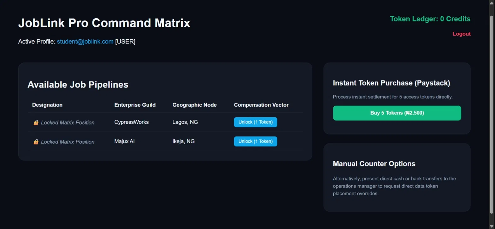

# JobLink Pro 💼

A full-stack job listing platform built with Spring Boot, featuring a token-based access system, Paystack payment integration, role-based authentication, and an admin command dashboard.

---

## Screenshots

### Login Page


### Admin Dashboard


### User Dashboard (Job Listings)


---

## Features

### 👤 Authentication & Roles
- Secure login system with email and password
- Two roles: **Admin** and **User**
- New user accounts require admin approval before login is granted
- Google Auth integration (in progress)

### 💼 Job Listings
- Jobs displayed as "Locked Matrix Positions" for regular users
- Each job shows company name, location, and salary
- Users must spend **1 token** to unlock and view full job details

### 🪙 Token System
- Users purchase tokens to access job listings
- **5 tokens for ₦2,500** via Paystack payment gateway
- Admin can manually credit tokens to any user account
- Token balance displayed on dashboard in real time

### 🛠️ Admin Command Matrix
- View and manage all registered users
- Pause or delete user accounts
- Promote users to Admin role
- Manually post jobs to the platform
- Fetch live jobs from external API automatically
- Credit tokens to user accounts manually

---

## Tech Stack

| Layer | Technology |
|-------|-----------|
| Backend | Java, Spring Boot |
| Frontend | HTML, CSS, JavaScript (Thymeleaf templates) |
| Database (Dev) | H2 In-Memory Database |
| Database (Prod) | PostgreSQL via Supabase |
| Payments | Paystack API |
| Containerization | Docker |
| Deployment | Render (via Docker) |

---

## Getting Started

### Prerequisites
- Java 17+
- Maven
- A Supabase account (for production database)
- A Paystack account (for payment integration)

### Installation

1. **Clone the repository**
```bash
git clone https://github.com/bishopttw/JobLink-Pro.git
cd JobLink-Pro
```

2. **Create a `.env` file** in the root folder with your credentials:
```env
DB_URL=your_supabase_database_url
DB_USERNAME=your_supabase_username
DB_PASSWORD=your_supabase_password
```

3. **Run the project**
```bash
./mvnw spring-boot:run
```

4. **Open in browser**
```
http://localhost:8080
```

### Default Admin Login
```
Email: admin@joblink.com
Password: password
```

---

## Project Structure

```
src/
├── main/
│   ├── java/com/niit/
│   │   ├── controllers/     # Route handlers
│   │   ├── models/          # Data models (User, Job, Token)
│   │   ├── repositories/    # Database access layer
│   │   └── services/        # Business logic
│   └── resources/
│       ├── templates/       # Thymeleaf HTML pages
│       ├── static/          # CSS and JavaScript files
│       └── application.properties
```

---

## Deployment

This project is configured for deployment on **Render** using Docker.

```bash
# Build the jar file
./mvnw clean package

# Build Docker image
docker build -t joblinkpro .

# Run Docker container
docker run -p 8080:8080 joblinkpro
```

---

## Known Issues / In Progress
- Paystack integration requires a valid live/test API key to process payments
- Google Auth login currently in development
- Error messages currently display in URL query params — UI error display coming soon

---

## What I Learned Building This
- Implementing role-based access control in Spring Boot
- Integrating third-party payment APIs (Paystack)
- Managing in-memory vs persistent database configurations
- Securing sensitive credentials using environment variables
- Designing a token economy system from scratch

---

## Author

**Prince Chukwuma**
- GitHub: [@bishopttw](https://github.com/bishopttw)
- LinkedIn: [Prince Chukwuma](https://linkedin.com/in/prince-chukwuma)
